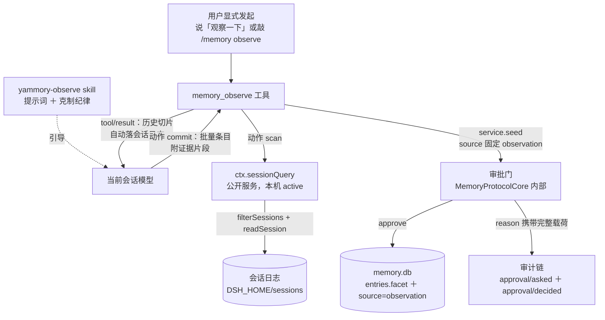

# 观察通道方案（S4 · 探路与选型）

> **状态**：设计稿，供 S4b 实现。本轮只读，未改任何源码、未提交。
> **基线**：`HEAD = e2d525e`，测试 214/214，门链 8/8，工作区干净。
> **内核基线**：DSH checkout `D:\DeepSeek-Harness\DSHAR工作目录\deepseek-harness-src`；下文 `packages/...` 指该 checkout 内的路径，`~/.dsh/...` 指本机 DSH_HOME（`C:\Users\杨安秋\.dsh`）。
> **证据口径**：凡标「实测」的，是本轮在本机读到的装配现状；凡标「内核」的，是内核源码或官方 README 的原文；凡标「待验」的，是我没有验证、S4b 必须先验的。

---

## 零、结论先行

### 0.1 三句话结论

1. **落点选「模型面工具 ＋ skill」，v1 显式触发，默认不自动跑。** 插件新增一个 `memory_observe` 工具负责「取历史切片」与「批量落库」，配一个 `yammory-observe` skill 承载推断提示词与纪律。推断这件事交给**当前会话里已经在跑的模型**，不另起模型调用。
2. **`ctx.sessionQuery` 是现成的历史读取通道，本机已挂载可用。** 精确读取、过滤、血缘追踪全通；全文搜索在 base 里默认关闭（`openAt: never`），观察不需要它。项目里 `recallHistory`（`index.mjs:2133`）已经是这条通道的只读先例。
3. **`ctx.llm` 直调这条路必须排除**，理由是它撞项目自己的红线「模型可见 ⟺ 落盘」：插件直调的模型请求不进任何会话日志，审计链会在推断这一步断掉。子代理（`ctx.subagents`）留在 v2，作为「不占主上下文」的升级路径。

### 0.2 落点图



### 0.3 五条必须记住的风险

| # | 风险 | 说明 |
|---|---|---|
| 1 | **`sessionQuery` 没有调用方授权** | 内核 README 原文：`No caller authorization — this is trusted context-wide infrastructure; a model tool or UI must constrain which sessions its caller may inspect.` 收窄责任 100% 在插件侧，做漏了就是跨工作区读别人的会话 |
| 2 | **`user/message` 不全是真人发言** | 同一事件类型下 `data.source.kind` 可能是 `plugin`（goal 驱动、tools-ptc 注入等）。不过滤就会把系统注入的伪发言当成用户表达，推断全歪 |
| 3 | **facet 粒度只到「面」，观察面是「子板块」** | `entries.facet` 取值是七面（`lib/constants.mjs:13`），而五个观察面（思维方式与思辨 / 人格特质 / …）是子板块。落库口径要先拍板，见 7.1 |
| 4 | **切片进主上下文，占用真实 token** | 这是本方案唯一的持续成本。切片预算失控 = 每次观察吃掉一大截上下文。默认值要保守，见 2.2 |
| 5 | **写库经审批门，一次观察可能产出多条** | 逐条审批会烦到用户放弃使用。要复用 `consolidate` 的「一次审批 ＋ 一次原子写」模式，见 4.2 |

---

## 一、落点选型

### 1.1 候选核账表

| 候选 | 能不能用 | 怎么用 | 代价 | 越界风险 | 裁决 |
|---|---|---|---|---|---|
| **A · 模型面工具 ＋ skill** | ✅ 能 | 插件注册 `memory_observe` 工具，`scan` 取切片、`commit` 批量写 | 切片占当前上下文 | **低**：只碰 `tools` ＋ `sessionQuery` 两个公开服务 | **采用** |
| **B · 子代理 `ctx.subagents`** | ⚠️ 服务面能，但本机模型面关着 | `ctx.subagents.start('spawn'\|'fork', {parent, prompt, signal, outputSchema})` | 一次观察 = 一次完整子代理会话，token 不可见；在 `~/.dsh/sessions/<ws>/` 留下新会话目录 | **中**：额外模型调用 ＋ 会话血缘污染 | 留 v2 |
| **C · 后台任务 `ctx.jobs`** | ❌ 本机不可用 | `jobs.start({kind, label, owner, run})`，`JobKindMap` 支持 declaration merging 扩展 | 本机 `tool-jobs` 是 `[disabled]`，`servesOwner` 直接抛 | — | 排除 |
| **D · 插件直调 `ctx.llm`** | ⚠️ 能，但撞红线 | `ctx.llm.stream(options)` | 要自选 provider/model、自算预算、自处理重试与并发 | **高**：请求不进任何会话日志，违反「模型可见 ⟺ 落盘」 | **排除** |
| E · 事件钩子 `agent/*` | ✅ 能，但不解决推断 | `ctx.on('agent/turn-stopping', …)` 等 | 无 | 低 | 只作为未来的触发时机 |
| F · 直读会话日志文件 | ❌ 不用 | `~/.dsh/sessions/<ws>/session-<id>/session.v3.jsonl.zstd` | zstd 解压 ＋ v0→v3 迁移梯子 ＋ 中断回合补齐 ＋ 自己实现授权 | **高** | 排除 |

### 1.2 逐项展开

**A · 模型面工具 ＋ skill（采用）**

内核里 `tool-session-query` 已经证明了这个形态可行（`packages/session-query/tool-session-query/src/index.ts:19` 的 `inject = ['tools', 'systemPrompt', 'sessionQuery', 'sessionProjections']`，注册 `session_search` / `session_event_search` / `session_trace` / `session_event_trace` / `session_event_read` 五个工具）。我们照这个形态做，但把「读什么、读多少」换成观察要的口径，并且**不把五个通用工具全开**——只开一个观察专用入口，把授权与预算收紧在工具内部。

这个形态最大的价值在审计上。模型看到的历史切片在 `tool/result` 里，模型的推断在 `assistant/message` 里，写入载荷在审批门的 `reason` 里。整条链都在会话日志可回放，符合项目「模型可见 ⟺ 落盘」的硬约束。内核 `session-query/README.md` 也把这条写成了设计目标：`Search results agree with the conversation history the model sees.`

**B · 子代理（留 v2）**

服务面本机是活的：`subagent`、`subagent-spawn-in-process`（provider 名 `spawn`）、`subagent-fork-in-process`（provider 名 `fork`）都是 `[active]`（实测）。接口签名在 `packages/subagent/subagent/src/index.ts:556`，请求类型在 `packages/subagent/subagent/src/types.ts:145`：

```
SubagentStartRequest = { label?, prompt: ContentBlock[], parent: Agent, signal: AbortSignal,
                         agentOptions?, outputSchema?, maxDepth?, toolFilter?, persona? }
```

`parent: Agent` 是**必填**的（`start` 实现里无条件访问 `request.parent.session`，`index.ts:571`）。这带来一个实际限制：插件只有在拿到 live Agent 的场合才能起子代理，命令面与懒触发场景拿不到。工具执行面能拿到（`exec.agent`，`index.mjs:544` 已有先例）。

`fork` provider 有个漂亮的性质：base 的装配注释写明它「omits model selection so provider/model stay equal to the parent and the inherited history remains eligible for KV Cache reuse」——也就是说 fork 出来的子代理**继承父会话历史**。这理论上很适合观察（子代理直接看到同一份历史）。

三条理由让它留在 v2：

- **成本不可见**。一次观察变成一次完整子代理会话（可能多轮工具调用），花掉多少 token 用户看不出来。v1 的显式触发承诺的是「你知道自己在花什么」。
- **血缘污染**。`ctx.subagents.start` 走 `establishCatalogChild`（`index.ts:571`），子代理是**新会话**，会在 `~/.dsh/sessions/<workspace-slug>/` 下留一个 session 目录。观察本身的产物变成会话历史噪音，还会被下一轮观察当成「历史」读到。
- **能力面还关着**。本机 `tool-subagent`、`tool-subagent-control`、`tool-subagent-fork` 全是 `[disabled]`（实测）。服务面可用、模型面不可用，意味着 v1 若走子代理，用户无法从对话里干预或中断它。

**C · 后台任务（排除）**

`JobKindMap` 确实支持插件扩展（`packages/jobs/jobs/src/types.ts:23-26`，注释原文 `Plugins extend this map by declaration merging`），`jobs-local` 对 `kind` 只校验非空字符串（`packages/jobs/jobs-local/src/index.ts:135`）。本机 `jobs-local` 也是 `[active]`。

挡住的是 `servesOwner` 这一关（`jobs-local/src/index.ts:132-133`）：

```
throw new Error('background jobs unavailable: no job controller serves this agent (load @deepseek-ai/dsh-tool-jobs in its composition)')
```

本机 `tool-jobs` 是 `[disabled]`（实测），所以 owned job 起不来。

更要紧的是**即使 job 起得来也解决不了问题**：`ctx.jobs` 只提供生命周期管理（`start` / `list` / `get` / `read` / `kill` / `wait`），模型调用不归它管。要在 job 里跑推断，还得回到候选 D 那条路。

**D · 插件直调 `ctx.llm`（排除）**

能力是有的：`packages/llm/llm/src/index.ts:56` 声明 `interface Context { llm: LlmRuntime }`，`stream(options: GenerateOptions)` 在 `index.ts:281`。本机 `llm`、`llm-deepseek`、`llm-pi-ai` 都是 `[active]`。

排除的决定性理由是审计断裂。项目红线写着「模型可见 ⟺ 落盘：注入模型的快照文本可自会话日志重建」（`AGENTS.md`）。插件直调的模型请求走 `ctx.llm.stream`，既不进本会话日志，也不进任何会话日志——于是「用什么提示词、模型得出什么结论、为什么这么推断」全都无法从会话日志重建。观察通道产出的恰恰是**关于用户的最敏感推断**，这一段最需要可审计，偏偏这一段会变成黑箱。

次因有三条：要自己选 provider/model（用户的默认模型配置住在 `~/.dsh/settings.yaml`，插件读不到那一层）；要自己算预算与超时；要自己防并发与失败重试。这些都是 DSH 的 agent-loop 已经付过成本的地方，重造一遍没有收益。

**E · 事件钩子（只作触发时机）**

内核的 agent 生命周期事件清单在 `packages/core/agent/src/runtime-types.ts:258-403`，共十个：`agent/created`、`agent/disposed`、`agent/status`、`agent/session-start`、`agent/pre-step`、`agent/request`、`agent/request-error`、`agent/assistant-stream`、`agent/turn-stopping`、`agent/error`。这些是挂在 cordis `Events` 上的公开事件，插件可以 `ctx.on` 订阅。

`agent/turn-stopping`（`Promise<void> | void` 型）是「自动触发」最自然的挂点——一轮对话将结束时评估要不要观察。v1 不挂它，理由见第三节。

**F · 直读会话日志文件（排除）**

会话日志的实际形态是 `~/.dsh/sessions/<workspace-slug>/session-<id>/session.v3.jsonl.zstd`——**zstd 压缩 ＋ v3 格式**（实测本项目那 11 个会话目录，单文件 807 KB）。自己读要处理：zstd 解压、v0→v1→v2→v3 的迁移梯子、写入者崩溃留下的中断回合补齐、replay 校验。`sessionQuery.readSession` 已经把这些做完了，注释写明它「replays the log through `Session.create` to reuse resume's validation」（`packages/session-query/session-query/README.md`）。重造这段没有意义。

### 1.3 为什么 A 是对的

观察通道要干三件事：**读历史**、**让模型推断**、**写库**。三件事各自都有现成的正确落点：

| 环节 | 现成落点 | 现状 |
|---|---|---|
| 读历史 | `ctx.sessionQuery`（公开服务） | 本机 active，项目已有先例 |
| 让模型推断 | 当前会话的模型（工具把切片递过去） | 零新增调用 |
| 写库 | `service.seed` ＋ 审批门（`MemoryProtocolCore` 内部强制） | S3 已接线 |

走 A 意味着**不新增任何基础设施**：不新增模型调用通道、不新增后台进程、不新增定时器、不新增数据库。新增的只有「一个工具 ＋ 一个 skill ＋ 一段预算逻辑」。这与 AGENTS.md 的哲学一致（只做插件，不碰引擎），也让 S4b 的工作量可估。

---

## 二、历史从哪来

### 2.1 读哪个 API

`ctx.sessionQuery`（服务类 `SessionQueryEngine`，`packages/session-query/session-query/src/index.ts:97`；服务声明在同文件 `84-88` 行的 `declare module '@deepseek-ai/cordis'`）。观察会用到四个方法，都在服务定义里，都不是 abstract（即**不需要全文搜索后端**就能用）：

| 方法 | 定义位置 | 观察怎么用 |
|---|---|---|
| `filterSessions(filters, signal)` | `index.ts:204` | 按 `cwd` ＋ `created-at` 收窄候选会话（服务端下推，一次过滤） |
| `readSession(sessionId)` | `index.ts:183` | 读一份完整、经 replay 校验的日志快照 |
| `filterEvents(sessionId, filters)` | `index.ts:278` | 按 `type` / `time` 定位事件（元数据记录，不含正文） |
| `readTitleSnapshots(ids, signal)` | `index.ts:249` | 折出会话标题，给切片做「这是哪一场」的抬头 |

`searchSessions` / `searchEvents` 是 abstract（`index.ts:152`、`index.ts:163`），要 `dsh-session-query-sqlite` 后端。本机的后端配置是（实测 `~/.dsh/profiles/node_modules/@deepseek-ai/dsh-base/cordis.patch.yml:129-133`）：

```yaml
- id: session-query-sqlite
  name: '@deepseek-ai/dsh-session-query-sqlite'
  config:
    path: ':memory:'
    openAt: never
```

`openAt: never` 时调用搜索会失败于 `SESSION_QUERY_SEARCH_DISABLED`，而同文件注释写明「exact reads, titles, and lineage traces … stay available」。观察要的是「最近的发言」，不是「匹配某个词的发言」，所以精确读取足够，**不需要动这个配置**（动它等于改数据面与部署配置，本轮红线禁止，S4b 也应避免）。

项目侧已有先例可直接借鉴：`recallHistory`（`index.mjs:2133-2176`）。它的做法是「`filterSessions` 以 cwd ＋ created-at 下推 → 取前 N 个候选 → `filterEvents` 定位 → `readSession` 取正文片段」，并且**用 `ctx.get('sessionQuery')` 拿可选服务、缺失时降级返回 `{available: false}`**。观察通道沿用同一套降级纪律。

### 2.2 读多少（范围与上限）

观察与召回的口径不同：召回是「找匹配」，观察是「看这个人怎么说话」。所以策略从「关键词定位」换成「按时间窗均匀采样」。

建议默认值（单位与量级需 S4b 实测标定，此处给的是保守起点）：

| 维度 | 默认 | 硬上限 | 理由 |
|---|---|---|---|
| 时间窗 | 14 天 | 90 天 | 周级颗粒度（清单第一节口径），14 天能覆盖 2 个完整周 |
| 会话数 | 8 个 | 20 个 | 按 `created-at` 倒序取最新；超出的在结果里报「未覆盖」 |
| 每会话发言条数 | 12 条 | 20 条 | 取「首条 ＋ 末条 ＋ 均匀间隔」，保留开场意图与收尾结论 |
| 单条截断 | 400 字符 | 800 字符 | 超过即截断加省略号，并标 `truncated` |
| **切片总字符预算** | **12000** | **30000** | 这是真正的闸门；到顶即停并在结果里报未覆盖范围 |

采样方式选「均匀间隔」而非「取前 N 条」：前 N 条只反映开场，思维模式与决策风格的证据往往出现在中后段（用户被追问、改主意、纠错的地方）。

`readEvent` 的邻接窗口有硬顶 `SESSION_QUERY_READ_WINDOW_MAX = 50`（`packages/session-query/session-query/src/config.ts:6`），观察用不到；真要取上下文时记住这个上限。

### 2.3 越界与敏感内容防护

三条闸，从外到内。

**闸一 · 授权收窄（最关键）**

内核把授权明确甩给了调用方。观察必须做到：

- 只读 `cwd` 与当前会话**精确相等**的会话（`filterSessions([{kind: 'cwd', values: [cwd]}])`）。
- 当前会话拿不到 `cwd` 时，**只读当前会话自己**，不做跨会话读取。内核的 `tool-session-query` 采用的正是这条保守口径（其 README：`a caller without cwd can inspect only itself`）。
- 不提供任何「读指定 sessionId」的模型入参。模型只能说「观察最近 N 天」，不能点名一个会话。

**闸二 · 事件过滤**

只取真人发言。这里的坑在于 `user/message` 这个事件类型下面是多种来源（内核 `packages/session/session-format-v2-to-v3/src/payload.ts:81` 的 `assertSource(data)` 证明该事件强制带 `source`）：

- 取：`data.source.kind === 'user'`（终端/直连输入）、`'user-rpc'`（浏览器提交）。

  注：`user-rpc` 的来源声明在 `packages/subagent/subagent/src/index.ts:181-185` 附近（`BrowserPromptSource`），本机 Web GUI 是主入口，浏览器提交的消息走的应当是这一类。**S4b 第一步就要把本机实际出现的 `source.kind` 枚举打出来核一遍**（待验）。
- 排除：`kind === 'plugin'`（goal 驱动、tools-ptc 等注入的伪消息）。内核测试里就有 `{ type: 'user/message', data: { source: { kind: 'plugin', plugin: 'goal' } } }` 这样的构造（`packages/session/session-format-v1-to-v2/tests/migration.spec.ts:443`），`session-title` 的 invariant 也专门判 `cited.data.source.kind !== 'user'`（`packages/session/session-title/src/invariant.ts:50`）。这类消息不是用户说的。
- 不取：`assistant/message`（模型的输出用来对照，不作为关于用户的证据）、`tool/result`（工具输出）、`system/message`、`request/header`（系统提示，可能含大量注入文本）。

**闸三 · 内容红线（写进提示词，不只是文档）**

- 不主动提取敏感属性：健康状况与疾病、性取向、宗教与政治立场、精确财务数字、精确住址与证件号。用户显式要求记住的除外。
- 不做临床或病理判断（不说「抑郁」「焦虑障碍」「ADHD」这类诊断词）。
- 不写负面人格评价。观察的产出应当是**可用的行为描述**，不是评价。
- 记忆库本身是本地的（`dbPath` 默认 `$DSH_HOME/dsh-memento/memory.db`，POSIX 0600），写入还过审批门，人的眼睛是第一道关。

---

## 三、触发与成本

### 3.1 v1：显式触发，默认不自动跑

两条触发路径，都要求用户先开口：

| 路径 | 形态 | 适用 |
|---|---|---|
| 用户直接说 | 「观察一下我」「看看你对我了解到什么程度」→ 模型经 skill 引导调 `memory_observe` | 自然语言，主路径 |
| 命令 | `/memory observe [--days=N] [--sessions=N]` | 精确控制参数，复用既有 `/memory` 命令族（`index.mjs:1584`） |

skill 的名字与触发纪律照 S3 问卷的模式（`skills/yammory-survey/`），并且抄它的一条关键设计：**约束写在正文首节，而不是靠 `disable-model-invocation` 硬禁**。问卷 skill 当时定的口径是「只由用户主动发起，模型不得自作主张开问卷」（清单 189 行），观察 skill 沿用同一句，理由也相同——若硬禁用模型调用，用户打字说「观察一下」这条最自然的路径会断掉。

**v1 明确不做的事**：

- 不挂 `agent/turn-stopping`（一轮结束就偷偷观察一次，正是「静默烧 token」）
- 不挂 `ctx.interval` / `ctx.timeout`（定时自动跑）
- 不在会话首次 assemble 时顺手跑（预热段的 `text` 回调必须同步，`systemPrompt` 提供者不 await，跑不了异步观察）
- 不监听 `session/event` 做实时观察（`handleSessionEvent` 在 `index.mjs:1310` 只处理 compaction 提案，保持现状）

### 3.2 单次扫描上限

已在 2.2 的表格里给了数。这里补三个纪律：

1. **到顶要说话**。切片因预算被截断时，工具结果必须含一行「未覆盖：N 个会话 / M 天」，让模型知道自己看的是局部。项目红线「失败要大声……绝不静默截断」同样适用于这里。
2. **不重复读已观察过的窗口**。工具结果里带上本次窗口的 `from` / `to`，skill 提示模型在下一轮从更早的窗口继续（观察是增量的，不必每次从头看）。
3. **参数由用户给，不由模型放大**。`--days` / `--sessions` 走模型入参时要过钳制（像 `MAX_QUERY_LIMIT` 那样在 Provider 层钳），模型不能通过传 `days=99999` 绕过预算。

### 3.3 自动触发日后要加的闸

若将来要加自动观察，需要五道闸，缺一不可：

| 闸 | 实现手段 | 现状 |
|---|---|---|
| **频率闸** | `ctx.interval` / `ctx.timeout`（cordis timer 已 `[active]`，API 见 `vendor/timer/README.md`：`ctx.timeout(callback, delay)` / `ctx.interval(callback, delay)`，句柄随 fiber 自动清理）＋ 最小间隔（建议 ≥24h） | 可用 |
| **预算闸** | 累计 token 或费用上限，超限停机；记账落审计表 | 要新建 |
| **开关闸** | Config 项（如 `observe.auto`）默认 `false`；`writePolicy` 是 Config、模型不可见不可改的既有范式可照抄 | 要新建 |
| **沉默闸** | 先查 `filterSessions` 有无新会话；无新内容直接跳过，不空跑模型 | 可用 |
| **可见闸** | 每次自动跑必须在会话里留一行可见记录（否则就是「静默烧 token」，与项目红线冲突） | 要设计 |

DSH 本机 base **没有装配 `dsh-schedule`**（base 依赖清单里没有它，内核 `packages/schedule/` 存在但未挂），所以定时能力要靠 `cordis-plugin-timer`，不要指望 schedule。若要「每天凌晨跑」，还得处理 DSH 进程不在时的补跑逻辑——这是 v2 的复杂度来源，v1 不碰。

---

## 四、写入口径

### 4.1 source 用什么

用 `'observation'`。

好消息是它**不需要动 schema 与校验**：`source` 在内核/项目里是自由字符串，不是枚举。现有取值有 `DEFAULT_SOURCE = 'dsh-memento'`（`lib/constants.mjs:66`）、`'memory-tool'`（`index.mjs:579/595/628`）、`'proposal'`（`index.mjs:1685`）、`'claude'`（seed 时）。审批粒度键的校验正则 `^source:[a-z0-9-]+$`（`lib/gate.mjs:96`）接受 `observation`。

**来源必须由工具锚定，不能由模型传参。** `memory` 工具的现状是 source 写死 `'memory-tool'`（模型不能指定），这是刻意的设计。观察沿用：`memory_observe` 的 commit 动作内部固定 `source: 'observation'`。若开放成模型入参，审计链就失去了「这条是谁写的」的可信度——模型可以说任何来源。

### 4.2 审批门与粒度键

**必须经审批门。** 红线写着「审批门不可绕过：写路径的强制点位于 `MemoryProtocolCore` 内部，不在工具层」。观察写入走 `service.seed(entries, { agent, gate })`（现成机制，`index.mjs:1795` 已在用），天然过门。

**一次 commit 一次审批。** 观察一次可能产出 3–8 条，逐条审批会把人烦跑。复用 `consolidate` 的模式：一次审批 ＋ 一次原子写。审批 reason 的格式由 `lib/gate.mjs:40/52` 的编解码定义，条目数会编码进 reason（`(\d+) entries`），已有这个字段位。

**给观察一个独立的粒度键**：`source:observation`。`lib/gate.mjs:65` 的解析优先级是「`source:<source>` 精确键 > `track/scope` 键 > 全局 `writePolicy`」。于是用户可以单独把观察设成 `auto`（信任）或 `off`（不写），而不影响问卷与其他写入。这是现成机制的复用，零新代码。

建议默认 `ask`。观察产出的是**推断**，质量需要人过第一道眼。等观察的准确率被验证之后，用户再自己改成 `auto`。

### 4.3 分面裁决

S3 已定的口径（`施工清单.md:191`，S5 实现时以此为准备受）：**能力听观察 / 意愿听自陈 / 落差两条都留，不删只标注来源与时间**。

落到观察通道，有一个**能大幅简化 v1 的事实**：五个观察面全部是「仅观察」面（S 集合，`施工清单.md:69-77`），而问卷 skill 的合法板块是 24 个非 S 板块。也就是说——

> **观察的主战场（5 个 S 面）与问卷的地盘（24 个板块）不重叠，v1 不存在真正的冲突。**

冲突只会出现在 4.4 说的「校正写入」（观察补充非 S 面）时。对 v1 的建议：

| 场景 | v1 处理 | 留给谁 |
|---|---|---|
| 观察写 5 个 S 面 | 直接新增，标 `source: 'observation'` ＋ `tags` 带时间戳 | 无需裁决 |
| 观察写非 S 面（校正） | 与既有条目**并存**，新条目文本里带前缀标明来源与观察时间，不删旧条目 | v1 就按并存做 |
| 自动覆盖 / supersede 旧条目 | **不做** | S5（soft delete 与仲裁） |

理由：S1 只落了 `status` 列与迁移，回滚语义留给 S5（`lib/constants.mjs:17` 注释原文：「S1 只落列与迁移，回滚语义留 S5」）。观察通道在 v1 抢先把裁决做掉，会与 S5 的实现打架。并存的代价是条目数变多、预算更快吃紧，但这个代价是可观测、可回收的。

### 4.4 五个观察面为主

主战场（`施工清单.md:69-77` 的 S 集合）：

| 观察面 | 所属顶层 | 为什么只有观察能拿到 |
|---|---|---|
| 思维方式与思辨 | II 心智 | 自评「我逻辑好」是最不可靠的一类自陈 |
| 人格特质 | II 心智 | 人看不清自己的气质与韧性 |
| 情绪模式与心理强度 | II 心智 | 身在情绪里，看不见自己的模式 |
| 自我认知（优缺点、盲区） | III 价值与意愿 | 自陈不可靠的典型 |
| 决策与行动风格 | V 行为与习惯 | 人对「自己怎么决策」的叙述常与行为相反 |

其余面**只在有明确证据时补充，且优先作「校正」**。证据门槛要高：一次观察里某个非 S 面的证据只出现一次，不写；出现三次以上、且是用户自己主动说出的，才考虑写。

一个具体的证据门槛草案（S4b 可调）：

- 单次观察内同一结论的证据片段 ≥ 2 处，或
- 同一结论跨 ≥ 2 场会话出现，或
- 用户明确自我陈述（此时归「自陈」，按分面裁决走）

---

## 五、推断提示词草案

放在 skill 正文（`skills/yammory-observe/SKILL.md`）与 `memory_observe` 的工具描述里。以下是一版可直接用的草案，克制是唯一的硬指标。

```text
# 任务

你在观察一位长期用户，从他的真实发言里推断「他自己看不清的那几面」。
输入是一段会话历史切片（只有他本人的发言，已按时间窗采样）。

# 只写有证据的

每一条结论必须附一处原话片段作为证据。找不到原话，就不写。
宁可写 0 条，不写没把握的第 1 条。0 条是合法输出。

一次观察最多 3 条。超过 3 条说明你在凑数。

# 禁止人格贴标签

不写人格类型标签（MBTI、九型、大五、依恋类型等一概不写）。
不写诊断（抑郁、焦虑障碍、ADHD 等一概不写）。
不写评价性人格判断（「偏执」「自恋」「情商低」一概不写）。

可以写的是：他在什么情境下做了什么、怎么做的、反复出现的模式是什么。
把「他是 X 型人」换成「他在 Y 情境下会做 Z，出现过 N 次」。

# 五个观察面

1. 思维方式与思辨 —— 他怎么拆问题、怎么用证据、什么时候改变看法
2. 人格特质 —— 面对困难与不确定时的稳定反应（不是性格类型）
3. 情绪模式与心理强度 —— 什么触发他的情绪、他怎么处理、恢复要多快
4. 自我认知 —— 他怎么说自己，以及他说的与做的是否一致（落差写下来）
5. 决策与行动风格 —— 他什么时候果断、什么时候拖延、靠什么拍板

不属于这五面的结论，只在证据非常明确时写，并且标注为「校正」。

# 敏感红线

不主动提取：健康状况与疾病、性取向、宗教与政治立场、精确财务数字、精确住址与证件号。
他明确说过「记住这个」的除外。
涉及上述内容时，跳过不写，不解释为什么跳过。

# 输出

对每条结论给出：
- 面（五个之一，或「校正」）
- 结论（一句话，行为描述，不带评价）
- 证据（原话片段，加会话标识与大致时间）
- 把握（高 / 中 / 低；低的不写）

低把握的直接丢弃，不要输出。
```

配套的 `memory_observe` 工具描述要点（双语，照 `MEMORY_TOOL_DESCRIPTION` 的模式）：

- 说明 `scan` 是只读、`commit` 走审批门
- 说明切片可能被预算截断，结果里会报未覆盖范围
- 说明 commit 的条目会被标 `source: 'observation'`，且一次 commit 一次审批
- 说明不要为了填满而写（宁少勿多写进工具描述，不只写在 skill 里——skill 可能没被加载，工具描述永远在）

---

## 六、S2 遗留项核对

S2 留的账是「工作区 / agent 轨条目失去自动可见性」（`施工清单.md:197`）：预热段按规格只放 `user` 轨 × `scope=user-global`（`index.mjs:1244` 注释确认），工作区层与 agent 轨条目退到 `memory_recall` 按需取，而 `memory_recall` 需要模型**先想到去查**。

**诚实结论：观察通道不能自然解决它。** 观察解决的是「画像怎么采集」，这条账是「记忆怎么注入」，两者在不同的层。观察做完了，工作区条目照样进不了预热段。

观察能贡献的是**判据**。有三个可接的点，按代价从低到高：

1. **一行目录（最省）**。预热段末尾加一行：「本工作区另有 N 条约定与教训待取」。它需要两个数：条数与「值不值得提醒」。观察顺手能产出后者——哪些工作区条目被反复召回、哪些从没被碰过。这一行约 20 个汉字，成本可忽略。
2. **情境触发**。预热段按当前话题领域给一行提示（例如话题落在「计算机」→ 提示「本项目有 5 条相关约定」）。这需要话题识别，属注入侧的活。
3. **会话首轮提示**。会话第一轮结束后由 `agent/turn-stopping` 挂一次轻提示。它引入事件钩子，代价最高。

建议把 1 号点作为 S4b 的**可选收尾项**（若预算允许就顺手做，做不了就单开一轮）。真正的注入侧设计不属于观察通道，2、3 号点留给后续的注入侧迭代。

---

## 七、风险与待决项

### 7.1 待决（S4b 开工前必须拍板）

| # | 问题 | 选项 | 建议 |
|---|---|---|---|
| 1 | **观察面落在哪个字段** | (a) 复用 `facet` 标到面级（心智），子板块进 `tags`；(b) 扩展 facet 到子板块级（动 schema v6）；(c) 新增 `subfacet` 列 | **(a)**。`entries.facet` 是七面枚举（`lib/constants.mjs:13`），五个观察面全是子板块。v1 用 `facet='心智'` ＋ `tags=['思维方式与思辨']` 落，零 schema 改动。等观察真的积累了数据，再决定要不要升级到 (b)/(c) |
| 2 | **`user/message` 的 `source.kind` 实况** | 本机实际出现哪些 kind | **S4b 第一步就实测**。理论上是 `user` / `user-rpc` / `plugin`，但必须打出来核。判错会把伪发言当证据 |
| 3 | **命名词表** | 工具名 / skill 名 / source 值 / 粒度键 | 建议 `memory_observe` / `yammory-observe` / `observation` / `source:observation`，四者对齐 |
| 4 | **是否复用 proposals 提案队列** | 审批门（同步）vs 提案队列（异步） | **审批门**。提案队列要用户想起来敲 `/memory proposals approve`，异步衰减快。若用户嫌审批打扰，可用 `writePolicies` 把它改成 `auto` |
| 5 | **切片进主上下文的价格** | 12k 字符默认值够不够 | 需实测。跑 3–5 次真实观察，量一下 token 与推断质量的关系再定 |

### 7.2 实现风险

| 风险 | 缓解 |
|---|---|
| **跨工作区越权读** | 闸一（cwd 精确相等；无 cwd 只读自己；不给模型 sessionId 入参）。这条要做成测试用例，不是靠自觉 |
| **把系统注入的伪发言当证据** | 闸二（只取 `source.kind ∈ {user, user-rpc}`）＋ S4b 第一步实测 |
| **预算失控吃上下文** | 硬字符顶 ＋ 到顶报「未覆盖」；参数在 Provider 层钳制，模型不能放大 |
| **审批打扰导致弃用** | 一次 commit 一次审批；`source:observation` 独立粒度键，用户可自行改 `auto` |
| **观察结果与 S5 仲裁打架** | v1 只做「并存 ＋ 标注」，不做 supersede。S5 实现时以 `施工清单.md:191` 的准备受 |
| **推断质量无法验证** | 每条结论强制附证据片段；审批时人看到的就是证据，可当场否决 |
| **写坏记忆库** | 无新增写路径：走 `service.seed` ＋ `MemoryProtocolCore`，审批门与审计链不变 |

### 7.3 连带成本（别漏算）

- **五语 README**：新增工具属于行为变更，AGENTS.md 要求「行为变更需同步五语 README，中/西/葡/印地四语同 commit 更新」。这是五份文件的改动。
- **覆盖率门**：`lib/` ≥90%、`index.mjs` ≥85%、all ≥90%。新的预算/过滤逻辑若落在 `lib/`，要配单测。
- **`package.json` files 白名单**：若新增被 `index.mjs` import 的模块，要同步加进去。
- **`verify:skill` 门**：S3 新增的门会检查 skill 完整性，新 skill 要过。
- **`docs/protocol-v1.md`**：若动到条目字段（例如 7.1 选了 b/c），协议文档与 JSON Schema 要同步双语。

---

## 八、S4b 分步实现计划

**总工作量估计**：一个完整轮次（与 S3 问卷通道同量级）。若砍掉 6 节的可选收尾项，可压缩到半个轮次。

| 步 | 做什么 | 交付物 | 验证 |
|---|---|---|---|
| **S4b-0** | **实测校准**（先做，半小时内）：打印本机 `user/message` 的 `source.kind` 实际枚举；量一次 12k 字符切片的 token 数 | 一段实测记录，写进 `施工清单.md` | 数字对得上才继续 |
| **S4b-1** | 新建 `lib/observe.mjs`（零 DSH 依赖，纯函数）：窗口采样、事件过滤、截断与预算记账 | 模块 ＋ 单测（覆盖率门要过） | `npm test`；边界用例（空切片、超预算、全被过滤） |
| **S4b-2** | 新增 `memory_observe` 工具：`scan` 走 `ctx.get('sessionQuery')` 只读取切片（缺失时响亮降级）；`commit` 走 `service.seed` ＋ 门，`source` 固定 `'observation'` | `index.mjs` 改动 ＋ 工具描述（双语） | mock ctx 集成测试；审批载荷断言 |
| **S4b-3** | 新建 `skills/yammory-observe/`（`SKILL.md` ＋ `references/observation-facets.md`），落第五节的提示词 | skill 目录 | `verify:skill` 门；项目级 `.dsh/skills` 实测被发现 |
| **S4b-4** | `/memory observe` 子命令接进既有命令族 | 命令面 | 命令测试 |
| **S4b-5** | 五语 README ＋ 覆盖率 ＋ 门链收口 | 五份 README ＋ 全门通过 | `npm test` / `typecheck` / `lint` / `check:coverage` / `check:readmes` / `verify:artifacts` / `verify:self-contained` / `verify:skill` |
| **S4b-6**（可选） | 6 节的「一行目录」收尾项 | 预热段加一行 | 快照测试 |

**建议的执行形态**：S4b-0 与 S4b-1 自己写（需要判断），S4b-2/3 可以按 S3 的成熟路径走，S4b-5 的门链必须自己过。**验证形态建议 `dual`**（自验 ＋ 独立复核）：观察通道动的是「关于用户的最敏感推断」，且新增了一条读会话历史的路径，值得一次冷视角复核。

**风险最大的两步**：S4b-1（预算与过滤逻辑错了会导致要么看不到东西、要么炸上下文）与 S4b-2（授权收窄做漏就是跨工作区越权）。这两步做扎实，其余是接线工作。

---

## 附录 A：证据索引

### 内核（路径相对于 `D:\DeepSeek-Harness\DSHAR工作目录\deepseek-harness-src`）

| 事实 | 位置 |
|---|---|
| `ctx.sessionQuery` 服务类与服务声明 | `packages/session-query/session-query/src/index.ts:84-88`、`:97` |
| 服务方法清单 | 同文件 `:139`（observeSession）、`:173`（listSessions）、`:183`（readSession）、`:204`（filterSessions）、`:249`（readTitleSnapshots）、`:267`（listEvents）、`:278`（filterEvents）、`:308`（readSurface）、`:325`（traceSession）、`:353`（readEvent） |
| 读窗口硬顶 50 | `packages/session-query/session-query/src/config.ts:6` |
| 事件过滤谓词定义 | `packages/session-query/session-query/src/types.ts:210-219` |
| **无调用方授权**（原文引用） | `packages/session-query/session-query/README.md`（「No caller authorization」段） |
| 模型面五工具与注入面 | `packages/session-query/tool-session-query/src/index.ts:19`、`:66-115` |
| 模型面工具的工作区授权口径 | `packages/session-query/tool-session-query/README.md`（「Workspace authority is conservative」段） |
| 子代理服务 `start()` | `packages/subagent/subagent/src/index.ts:556` |
| `SubagentStartRequest`（`parent` 必填） | `packages/subagent/subagent/src/types.ts:145-200` |
| 子代理生命周期事件 | `packages/subagent/subagent/src/index.ts:133-171` |
| jobs 抽象服务 | `packages/jobs/jobs/src/index.ts:82`（start） |
| `JobKindMap` 可扩展 | `packages/jobs/jobs/src/types.ts:23-26` |
| job controller 前置要求（原文报错） | `packages/jobs/jobs-local/src/index.ts:132-133` |
| `ctx.llm` 服务声明与 stream | `packages/llm/llm/src/index.ts:56`、`:281` |
| agent 生命周期事件清单 | `packages/core/agent/src/runtime-types.ts:258-403` |
| `user/message` 强制带 source | `packages/session/session-format-v2-to-v3/src/payload.ts:81` |
| 插件注入的伪 user 消息实例 | `packages/session/session-format-v1-to-v2/tests/migration.spec.ts:443` |
| 真人消息判定先例 | `packages/session/session-title/src/invariant.ts:50` |
| timer API | `vendor/timer/README.md` |

### 本机装配（实测）

| 事实 | 位置 / 依据 |
|---|---|
| base 依赖含 `dsh-session-query-sqlite`、`dsh-subagent`、`dsh-jobs-local`、`dsh-llm`，不含 `dsh-tool-session-query` | `~/.dsh/profiles/node_modules/@deepseek-ai/dsh-base/package.json` |
| session-query-sqlite 配置 `openAt: never`（搜索关闭、精确读取可用） | `~/.dsh/profiles/node_modules/@deepseek-ai/dsh-base/cordis.patch.yml:129-133` |
| `jobs-local` / `subagent` / `spawn` / `fork` / `llm` `[active]`；`tool-jobs` / `tool-subagent*` `[disabled]` | `dev_plugin_status` 输出 |
| 会话日志形态 `session.v3.jsonl.zstd` | `~/.dsh/sessions/--D-GitHub_place-~8BB0~5FC6~7CFB~7EDF--/session-c9b00a49-…/` |
| 本项目会话目录 11 个 | 同上父目录 |

### 项目侧

| 事实 | 位置 |
|---|---|
| sessionQuery 只读消费先例（含降级） | `index.mjs:2133-2176`（`recallHistory`） |
| 工具 exec 可拿 agent | `index.mjs:544`、`:2053-2068` |
| `memory` 工具参数面与 source 写死 | `index.mjs:393-446`、`:579/595/628` |
| `memory_profile` 工具 | `index.mjs:767` |
| `service.seed` 批量写 ＋ gate | `index.mjs:1795`、`:1924` |
| 审批 reason 编解码（含条目数位） | `lib/gate.mjs:40`、`:52` |
| 粒度策略优先级与键校验 | `lib/gate.mjs:65`、`:96` |
| 七面枚举（不含子板块） | `lib/constants.mjs:13-15` |
| `status` 列与 S5 留账 | `lib/constants.mjs:17` |
| `source` 自由字符串与既有取值 | `lib/constants.mjs:66`、`index.mjs:1685` |
| 预热段只取 user × user-global | `index.mjs:1244` |
| `session/event` 监听（仅 compaction） | `index.mjs:1310` |
| S 集合五面 | `施工清单.md:69-77` |
| 分面裁决口径 | `施工清单.md:191` |
| S2 未闭合项 | `施工清单.md:197` |
| 服务消费红线与注入面 | `index.mjs:10`、`:143`；`AGENTS.md` |

---

## 附录 B：与 S3 的接缝

观察与问卷是同一采集系统的两条腿，共用的东西要认清，免得 S4b 重造：

| 共用件 | 现状 | S4b 是否要动 |
|---|---|---|
| 审批门 ＋ 审计链 | S1 建，S3 接线 profile 写入 | 不动，直接复用 `service.seed` |
| 七面 facet 词汇 | S1（`PROFILE_FACETS`） | 不动，观察面靠 tags 承载子板块 |
| 分领域知识水平表 | S1 建表，S3 补写入通道（`memory_profile`） | 大概率不动。观察若发现「能力面」证据，走 `memory_profile` 校正档位而非 `memory` |
| skill 形态与触发纪律 | S3（`skills/yammory-survey/`） | 照抄形态，不共享文件 |
| 条目文本颗粒度（2–3 句） | S3 定 | 沿用 |
| 「宁少勿多」的克制 | S3 的 70% 判据 | 观察用更严的证据门槛（见 4.4） |

一句话记住分工：**问卷问「你想要什么」，观察看「你实际怎么做」。** 两者在用户身上交叉验证，落差本身就是有价值的信息。
